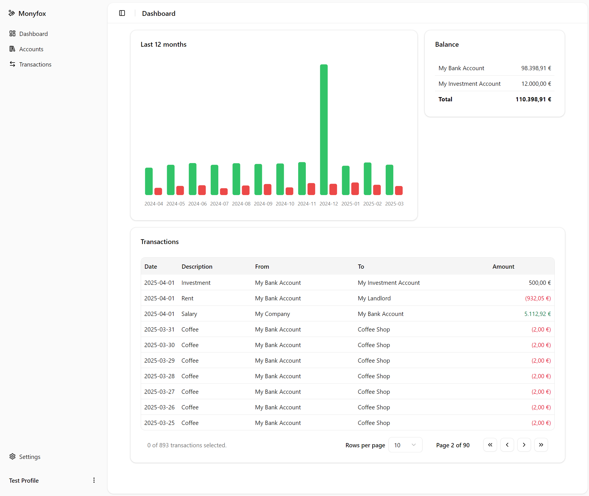

# Monyfox

Welcome to Monyfox, your comprehensive open-source solution for managing your finances efficiently. Monyfox is a web app that works 100% locally. It is designed to help you keep track of your money, visualize your financial data with insightful charts, and plan for a better financial future.



## Features

- 💰 **Track Your Money:** Easily record and monitor your income, expenses, savings, investments, and transfers.
- 📊 **Visualize Your Finances:** Utilize charts and graphs to gain a clear understanding of your financial situation.
- 💻 **User-Friendly Interface:** Intuitive design for seamless navigation and usage.
- 🌐 **100% Open Source:** Fully open-source, ensuring transparency and customization options.
- 🏠 **100% Local:** All data is stored locally on your device, ensuring privacy and security.

### Upcoming Features

- 📈 **Stock Tracking:** Monitor your investments and track stock performance.
- 💳 **Budgeting Tools:** Set budgets and track your spending to stay on target.
- 📂 **Data Import:** Import financial data from various sources for a unified view.
- 📤 **Data Export:** Export your financial data for backup or analysis.
- 💾 **Backup and Restore:** Easily backup and restore your financial data.
- 💶💵 **Multi-Currency Support:** Manage your finances in multiple currencies with ease.

* 📱 **Mobile App:** Access Monyfox on the go with a dedicated PWA.
* 🌐 **Sync Across Devices:** Sync your financial data across multiple devices for seamless access. The data will be encrypted and stored in a secure cloud service.

## Getting Started

### Installation

1. **Clone the Repository:**

   ```bash
   git clone https://github.com/LucaDiba/monyfox.git
   ```

2. **Navigate to the Project Directory:**

   ```bash
   cd monyfox
   ```

3. **Install Dependencies:**

   ```bash
   yarn
   ```

4. **Run the Application:**
   ```bash
   cd apps/client/dashboard
   yarn dev
   ```

## Contributing

We welcome contributions from the community!

## License

Monyfox is licensed under the EUPL-1.2 License. See the [LICENSE](LICENSE) file for more details.

## Contact

For any questions or support, please open an issue in the GitHub repository.

---

Thank you for choosing Monyfox! We hope it helps you manage your finances more effectively. Happy saving! 🎉
